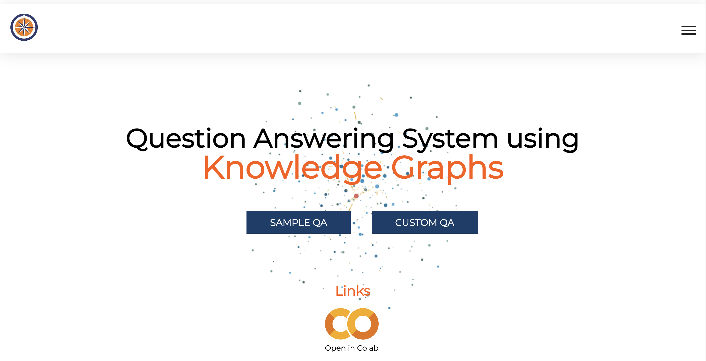
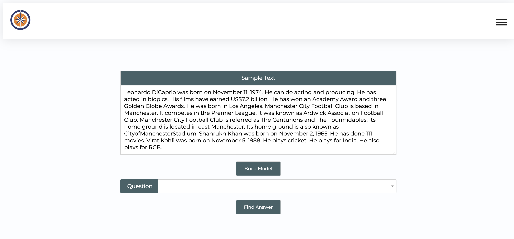

# Question Answering System using Knoweldge Graph : Capstone Project

Question Answering Systems using KG catering to single and multi hop questions, using spaCy entity extraction and depedency parsing. 



## Features

- Answers WHAT, WHEN, WHERE, WHO questions
- Picks out relevant sentences for inference type of questions
- User friendly interface to interact with model


## To run locally
Clone the project

```bash
  git clone https://github.com/shreyasdvrj/question-answering-knowledge-graph.git
```
Go to the project directory

```bash
  cd question-answering-knowledge-graph
```

Install dependencies

```bash
  pip install -r requirements.txt 
```
To run the code
```bash
  python app.py 
```

Go to [localhost:8000](http://127.0.0.1:8000/)
- Sample text has pre-feined text with examples
- Custom text : User can enter own text
- Click on `Build Model` to construct KG
- Ask question to obtain answer

